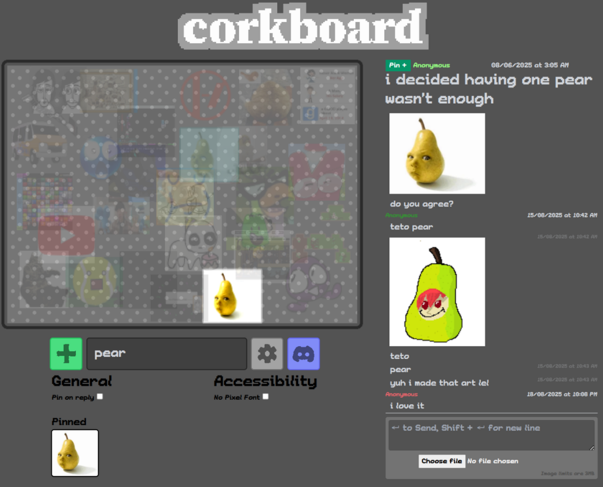

# 

**[corkboard](https://corkboard.zelo.dev)** is a real-time forum in which posts are pins in a corkboard.

## Tech Stack

- **SvelteKit** as fullstack framework
- **[SST](https://sst.dev/)** for managing the AWS infrastructure
- **AWS**:
  - **DynamoDB** for storing posts and user data
  - **Rekognition** for attachment moderation
  - **ApiGateway** for real-time updates using websockets
  - **S3** for storing post attachments
  - **CloudFront** for serving the CDN

- **Umami** for analytics
- **Pixi.JS** for rendering the corkboard itself

## Contribute

Feel free to open an issue if you have any suggestions, or tell me in my [discord](https://discord.gg/YVuuF9KB5j). Issues regarding accessibility are especially welcome!
